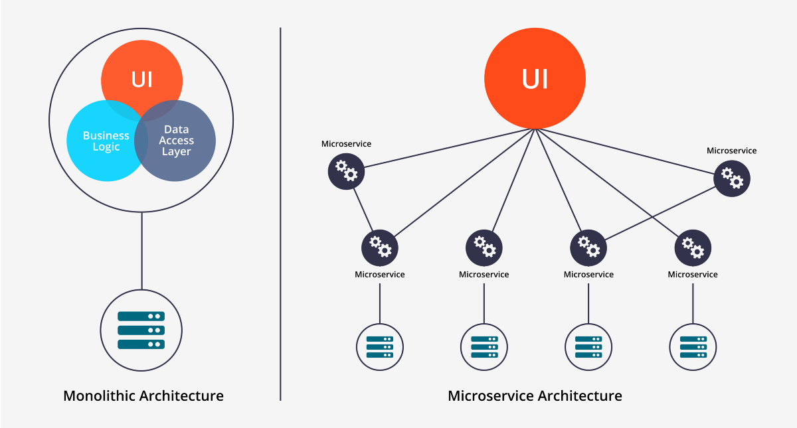

# Microservice vs Monolithic

## Monolithic

* Easy to develop, deploy, and debug
* Cannot be scaled independently

## Microservice

* Difficult to develop, deploy, and debug
* Can be scaled independently

# Microservice Communication

* Client Server
* Pub Sub

# Our Architecture

