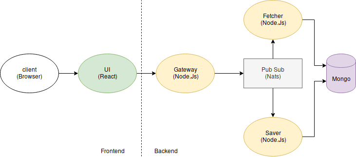

# Microservice vs Monolithic

## Monolithic

* Easy to develop, deploy, and debug
* Cannot be scaled independently

## Microservice

* Difficult to develop, deploy, and debug
* Can be scaled independently

# Microservice Communication

## Request/Response

### Problem with Request/Response

* Service Discovery
* Error Recovery (solution: Saga Pattern)

## Pub/Sub

### Problem With Pub/Sub

* Bottle neck
* Single point of failure

# Our Architecture

